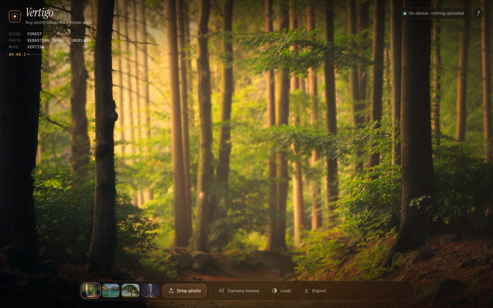
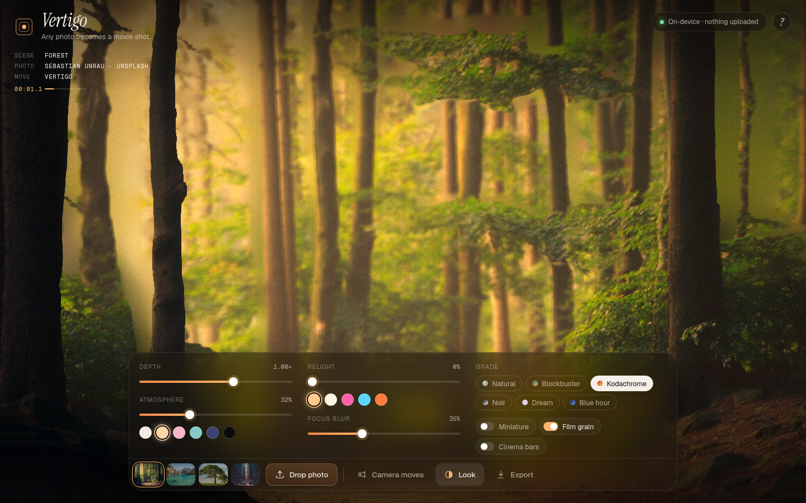

# Vertigo

**Any photo becomes a movie shot. On your device. Nothing uploaded.**

[](https://chris-wozniczek.github.io/vertigo/)

### ▶ Live demo: https://chris-wozniczek.github.io/vertigo/

Vertigo turns a single still photo into a living 3D diorama and films it with cinematic camera moves — a Hitchcock dolly zoom, a Ken Burns push, an orbit, a crane, a swing. A small depth AI runs right in your browser, so your photo never leaves your device.

## How to use

1. **Drop a photo** — drag it onto the page, paste it (⌘/Ctrl+V), pick a file, or tap one of the samples.
2. **Pick a camera move** — Vertigo, Ken Burns, Orbit, Crane, Swing or Window. Move your mouse (or tilt your phone) to peek around.
3. **Set the look** — depth intensity, atmosphere haze and color, relight (drag the light), click the scene to set focus, miniature tilt-shift, film grain, grades.
4. **Export** — a seamless 4–6 s loop as MP4/WebM in 16:9, 1:1 or 9:16 at 1080p, or a PNG still.

The first visit opens a short "How to use" card; reopen it any time with the **?** button.



## How it works

- **Depth** — [Depth Anything V2 Small](https://huggingface.co/onnx-community/depth-anything-v2-small) runs through [Transformers.js](https://github.com/huggingface/transformers.js) in a Web Worker: WebGPU (fp16) when available, WASM (q8) otherwise. Weights (~25–50 MB) are fetched once from the Hugging Face CDN and cached by the browser. The bundled samples ship with precomputed depth maps, so the first frame is instant with no download.
- **Prep** — depth is percentile-normalized and edge-aware smoothed. Depth discontinuities mark where the foreground will occlude; those pixels are removed from a *background plate* and refilled with a multi-scale push–pull inpaint, with depth pushed back behind the foreground.
- **Scene** — two subdivided planes (foreground + inpainted plate) are displaced in a vertex shader (Three.js). Stretched triangles at depth edges fade out in the fragment shader, revealing the plate behind them instead of smeared "rubber sheet" tears.
- **Camera** — each move is a looping, eased path; the dolly zoom counter-animates field of view against distance to keep the subject locked while the world warps.
- **Look** — normals are derived from the depth gradient for relighting; fog, depth of field (focus picked by clicking), tilt-shift, grades, grain, vignette and bars are a single post pass.
- **Export** — `canvas.captureStream()` + `MediaRecorder` record exactly one loop period at 1080p, so the clip loops seamlessly. MP4 (H.264) where the browser supports it, else WebM.

## Privacy

Everything runs in your browser. Photos are decoded, analysed and rendered locally; there is no server, no analytics and no upload. The only network requests are the static site itself, fonts, and the model weights from Hugging Face.

## Tech stack

Vanilla JS · [Three.js](https://threejs.org) with custom GLSL · [Transformers.js](https://github.com/huggingface/transformers.js) (ONNX Runtime Web, WebGPU/WASM) · Depth Anything V2 Small · Vite · GitHub Pages. Fonts: Instrument Serif, Geist, Geist Mono.

## Run locally

```bash
git clone https://github.com/chris-wozniczek/vertigo.git
cd vertigo
npm install
npm run dev      # http://localhost:5173
npm run build    # static site in dist/
```

`scripts/depth.mjs` regenerates the sample depth maps with Node (`node scripts/depth.mjs`).

## Sample photo credits

All samples are from [Unsplash](https://unsplash.com) under the [Unsplash License](https://unsplash.com/license).

- Forest — Sebastian Unrau
- Lake Braies — Pietro De Grandi
- Lone Tree — Unsplash
- City Canyon — Max Bender

## Built for Hackyard Yard #3 — One Screen

Built for [Hackyard Yard #3](https://hackyard.tech/yards/yard-3), theme **One Screen**: everything happens on a single view — panels, overlays and modals, no routes or wizards. All code was written fresh during the build week (Sep 21–25, 2026).

Built by [Devin](https://devin.ai) (Cognition AI) for Krzysztof Woźniczek ([@chris-wozniczek](https://github.com/chris-wozniczek)).

## License

[MIT](LICENSE)
